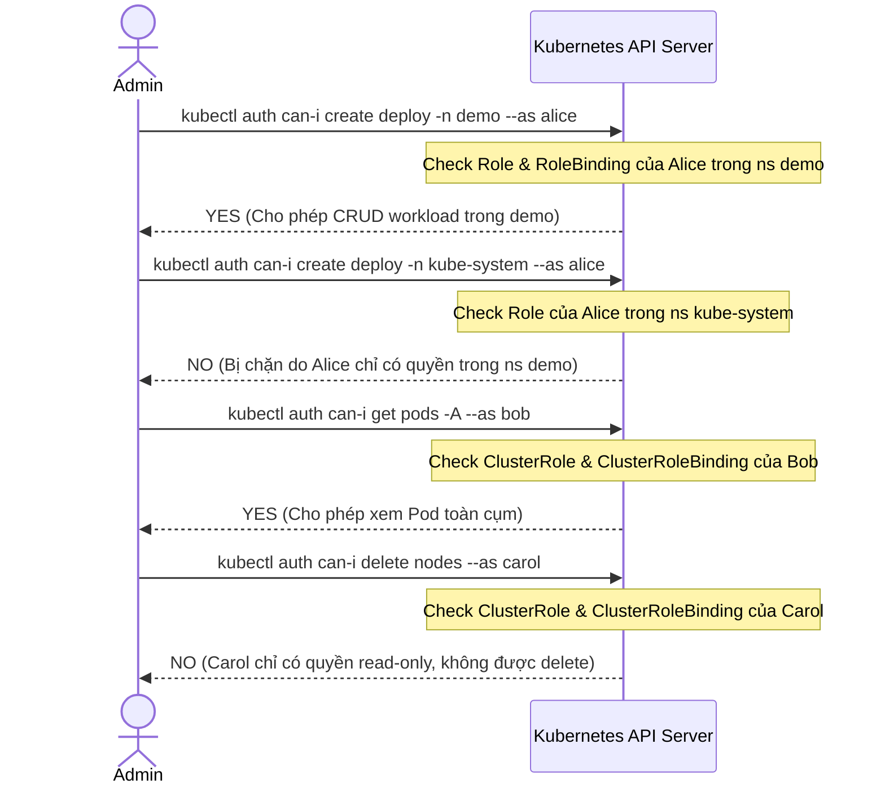
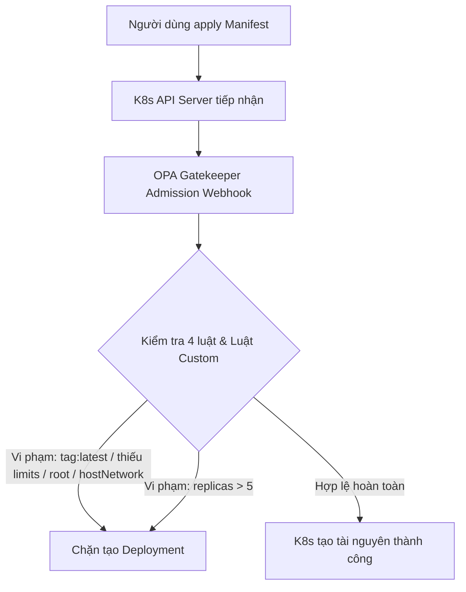
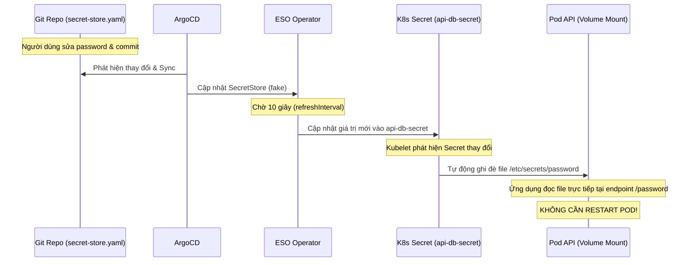
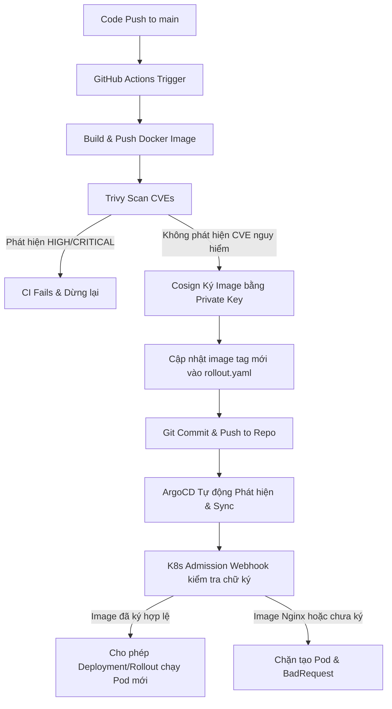

# Hướng Dẫn Học Thuộc Hệ Thống (Lab 1 & Lab 2)
### RBAC + OPA Gatekeeper + Progressive Delivery + Secret Rotation + Container Security

Tài liệu này tổng hợp toàn bộ cấu trúc file, lý do tồn tại của từng thành phần, và luồng hoạt động chi tiết của cả **Lab 1** và **Lab 2** nhằm phục vụ cho việc học thuộc lòng, ôn tập lý thuyết, và nắm bắt nhanh kiến trúc hệ thống.

---

## 1. Bản Đồ Mối Quan Hệ Giữa Các File (Cấu Trúc Thư Mục)

Dưới đây là sơ đồ giải thích lý do tại sao từng file được tạo ra và vai trò của chúng trong hệ thống:

```
w10/
├── argocd/
│   ├── root.yaml                 # [LÝ DO] File cấu hình tối cao (App of Apps). Quản lý tất cả các App con.
│   └── apps/                     # Thư mục chứa các ứng dụng ArgoCD
│       ├── app-common.yaml       # [LÝ DO] Khởi tạo namespace "demo" đầu tiên.
│       ├── rbac.yaml             # [LÝ DO] Cài đặt cấu hình phân quyền RBAC (Alice, Bob, Carol) (Sync Wave 1).
│       ├── gatekeeper.yaml       # [LÝ DO] Cài đặt OPA Gatekeeper Controller (Sync Wave sớm).
│       ├── gatekeeper-constraints.yaml # [LÝ DO] Apply các Constraint & Template của Gatekeeper (Sync Wave 1).
│       ├── eso.yaml              # [LÝ DO] Cài đặt External Secrets Operator (Sync Wave -1).
│       ├── eso-config.yaml       # [LÝ DO] Cấu hình SecretStore và ExternalSecret (Sync Wave 1).
│       ├── policy-controller.yaml# [LÝ DO] Cài đặt Admission Controller của Sigstore/Cosign (Sync Wave -1).
│       ├── policies.yaml         # [LÝ DO] Cấu hình ClusterImagePolicy xác thực chữ ký (Sync Wave 1).
│       └── app-api.yaml          # [LÝ DO] Triển khai ứng dụng API chính dưới dạng Argo Rollout.
│
├── rbac/
│   ├── roles.yaml                # [LÝ DO] Khai báo Role (Namespace) và ClusterRole (toàn cụm) cho 3 người dùng.
│   └── rolebindings.yaml         # [LÝ DO] Ràng buộc Role/ClusterRole tương ứng với alice, bob, carol.
│
├── gatekeeper/
│   └── constraints/
│       ├── custom-template.yaml  # [LÝ DO] Chứa 5 mã nguồn Rego (ConstraintTemplates) dùng để check luật admission.
│       └── k8s-security-policies.yaml # [LÝ DO] Chứa các Constraints cụ thể cấu hình tham số cho 5 luật đó.
│
├── app-common/
│   └── demo-namespace.yaml      # [LÝ DO] Tạo namespace "demo" với label kích hoạt policy: `policy.sigstore.dev/include: "true"`.
│
├── eso/
│   ├── secret-store.yaml         # [LÝ DO] Tạo SecretStore sử dụng Fake Provider (mô phỏng AWS Secrets Manager).
│   └── external-secret.yaml      # [LÝ DO] Định nghĩa cách đồng bộ secret từ fake provider vào K8s Secret (refresh mỗi 10s).
│
├── signing/
│   └── cosign.pub                # [LÝ DO] Public key của Cosign dùng để xác minh chữ ký image trên Cluster.
│
├── policies/
│   └── cluster-image-policy.yaml # [LÝ DO] Chính sách bắt buộc mọi image từ ghcr.io phải ký bằng public key tương ứng.
│
├── src/api/
│   ├── app.py                    # [LÝ DO] Mã nguồn API (Python Flask), đọc mật khẩu từ file `/etc/secrets/password`.
│   └── Dockerfile                # [LÝ DO] Đóng gói ứng dụng thành Docker Image để deploy.
│
├── app-api/
│   └── rollout.yaml              # [LÝ DO] Thay thế Deployment thường bằng Argo Rollout để deploy dạng Canary.
│                                 # Sử dụng Volume Mount để đọc secret từ api-db-secret (không restart Pod khi đổi secret).
│
├── app-analysis/
│   └── analysis-template.yaml    # [LÝ DO] Định nghĩa cách đo lường tỷ lệ lỗi khi deploy Canary.
│
├── .github/workflows/
│   └── build-push.yml            # [LÝ DO] Tự động hóa CI/CD: Build -> Scan Trivy -> Ký Cosign -> Update Tag vào Git.
```

---

## 2. Chi Tiết Từng Lab & Từ Khóa Cốt Lõi Để Học Thuộc

### A. Lab 1.1: Phân Quyền RBAC qua GitOps (Alice, Bob, Carol)
*   **Mục tiêu:** Phân quyền cụ thể cho 3 tài khoản người dùng khác nhau trên Cluster mà không áp dụng thủ công bằng tay.

#### 1. `rbac/roles.yaml` (Định nghĩa quyền)
*   **Alice (Developer):** CRUD workload (Pod, Deployment, Service, log) **chỉ trong namespace `demo`**.
    *   *Từ khóa:* `kind: Role`, `namespace: demo`, `resources: ["pods", "deployments", "services", "pods/log"]`, `verbs: ["create", "get", "list", "watch", "update", "patch", "delete"]`.
*   **Bob (SRE):** Thao tác Pod (get, list, exec, port-forward, log, create, delete) **trên toàn bộ cluster**.
    *   *Từ khóa:* `kind: ClusterRole`, `resources: ["pods", "pods/exec", "pods/portforward", "pods/log"]`.
*   **Carol (Viewer):** Chỉ đọc (read-only) **toàn bộ tài nguyên trên toàn bộ cluster**.
    *   *Từ khóa:* `kind: ClusterRole`, `resources: ["*"]`, `verbs: ["get", "list", "watch"]`.

#### 2. `rbac/rolebindings.yaml` (Ràng buộc đối tượng)
*   **Alice:** Dùng `RoleBinding` gắn `developer-role` trong namespace `demo`.
*   **Bob & Carol:** Dùng `ClusterRoleBinding` gắn `sre-clusterrole` và `viewer-clusterrole` ở cấp độ Cluster.
*   **Từ khóa quan trọng:** `subjects: - kind: User / name: <username>`.

---

### B. Lab 1.2 & 1.3: OPA Gatekeeper & Custom Policy (Rego)
*   **Mục tiêu:** Bắt và từ chối các manifest vi phạm chính sách an toàn của Cluster ngay tại Admission Controller.

#### 1. Các file cài đặt và cấu hình
*   `argocd/apps/gatekeeper.yaml` (Cài Controller trước ở Sync Wave sớm).
*   `gatekeeper/constraints/custom-template.yaml` (Định nghĩa cấu trúc schema và logic Rego).
*   `gatekeeper/constraints/k8s-security-policies.yaml` (Khởi tạo luật với tham số).

#### 2. 4 Luật Chặn Manifest Xấu (Lab 1.2)
1.  **Cấm image tag `:latest`:** Ép buộc các Pod phải chỉ định rõ tag version cụ thể nhằm tránh lỗi không kiểm soát được phiên bản.
    *   *Template:* `K8sRequiredTags` (Đọc image từ container và kiểm tra đuôi `:latest` hoặc không có dấu hai chấm `:`).
2.  **Bắt buộc có `resources.limits`:** Tránh hiện tượng một Pod chiếm dụng hết tài nguyên CPU/RAM của Node làm sập cả cụm.
    *   *Template:* `K8sContainerLimits` (Kiểm tra `not container.resources.limits.cpu` hoặc `not container.resources.limits.memory`).
3.  **Cấm `runAsUser: 0` (Chạy quyền root):** Tránh lỗ hổng leo thang đặc quyền từ container ra ngoài Host Node.
    *   *Template:* `K8sPSPAllowedUsers` (Vi phạm khi `securityContext.runAsUser == 0` hoặc cấu hình `runAsNonRoot == false`).
4.  **Cấm `hostNetwork: true`:** Cấm Pod sử dụng dải mạng của máy chủ để tránh lộ cổng hệ thống.
    *   *Template:* `K8sPSPHostNetworkingPorts` (Kiểm tra `spec.hostNetwork == true`).

#### 3. Luật Custom viết bằng Rego (Lab 1.3 - Max 5 Replicas)
*   **Mục đích:** Từ chối mọi Deployment có số lượng Replicas lớn hơn 5.
*   **Mã Rego cốt lõi cần nhớ:**
    ```rego
    package k8smaxreplicas

    violation[{"msg": msg}] {
      spec_replicas := input.review.object.spec.replicas
      spec_replicas > input.parameters.max
      msg := sprintf("So luong replicas (%v) vuot qua muc cho phep toi da la %v", [spec_replicas, input.parameters.max])
    }
    ```

---

### C. Lab 2.1: Secret Rotation không restart Pod (External Secrets Operator - ESO)
*   **Mục tiêu:** Đồng bộ mật khẩu tự động và cập nhật trực tiếp vào Pod mà không làm gián đoạn (restart) ứng dụng.

#### 1. `eso/secret-store.yaml` (SecretStore)
*   Dùng **Fake Provider** để giả lập Secrets Manager của Cloud AWS/GCP trên môi trường Lab local.
*   *Từ khóa:* `provider: fake`.

#### 2. `eso/external-secret.yaml` (ExternalSecret)
*   *Từ khóa:* `refreshInterval: 10s` (Đồng bộ mỗi 10 giây).

#### 3. `app-api/rollout.yaml` (Phần Secret)
*   *Cấu hình cốt lõi:* Sử dụng **Volume Mount** gắn file mật khẩu `/etc/secrets/password` từ K8s Secret `api-db-secret`.
*   *Cơ chế:* Khi ESO cập nhật Secret, Kubelet tự đồng bộ file mới vào container. API đọc trực tiếp từ file (không qua biến môi trường `env`) nên **không cần restart Pod** để nhận mật khẩu mới.

---

### D. Lab 2.2: Bảo Mật Container (Trivy + Cosign)
*   **Mục tiêu:** Đảm bảo toàn bộ image chạy trên cụm đều phải quét lỗ hổng và có chữ ký số hợp lệ.

#### 1. `app-common/demo-namespace.yaml`
*   *Từ khóa:* Label: `policy.sigstore.dev/include: "true"`. Kích hoạt bộ kiểm tra chữ ký số cho namespace `demo`.

#### 2. `policies/cluster-image-policy.yaml` (ClusterImagePolicy)
*   *Cơ chế:* Chứa Public Key `cosign.pub` để xác thực chữ ký của các image thuộc repo `ghcr.io/rabbitboy123/**`.

#### 3. `.github/workflows/build-push.yml` (CI Pipeline)
*   *Luồng bảo mật tĩnh:* Build Image -> **Quét Trivy** (nếu phát hiện CVE HIGH/CRITICAL thì Pipeline **FAIL ngay lập tức** và dừng) -> Nếu sạch, **Cosign ký image bằng Private Key** -> Cập nhật Git.

---

## 3. Luồng Hoạt Động Của Hệ Thống (Flows) - Trả Bài Miệng

### Luồng 1: Xác thực phân quyền RBAC


### Luồng 2: Admission Control chặn Manifest xấu (Gatekeeper)

> **Mẹo vận hành:** Khi cấu hình Gatekeeper trên hệ thống đang chạy, hãy đổi `enforcementAction: warn` trước để rà soát danh sách vi phạm qua log audit, tránh dùng `deny` ngay lập tức làm gián đoạn các dịch vụ đang chạy bình thường.

### Luồng 3: Secret Rotation không restart Pod


### Luồng 4: CI/CD Pipeline Bảo mật (Trivy + Cosign + Verification)


---

## 4. Các Câu Hỏi Phỏng Vấn & Mẹo Trả Lời Nhanh

**1. Sự khác biệt giữa `Role` và `ClusterRole` là gì?**
*   *Trả lời:* `Role` giới hạn quyền trong một namespace cụ thể (ví dụ: `demo`). `ClusterRole` định nghĩa quyền trên toàn bộ Cluster (áp dụng cho tất cả namespaces hoặc tài nguyên phi namespace như Node, PersistentVolume).

**2. Tại sao ta dùng `--as <username>` khi chạy lệnh `kubectl`?**
*   *Trả lời:* Đây là tính năng **User Impersonation** (Giả lập người dùng) của Kubernetes. Nó giúp quản trị viên (Admin) kiểm tra nhanh xem một người dùng có thực hiện được hành động nào đó hay không mà không cần phải đăng nhập bằng thông tin xác thực của họ.

**3. Tại sao nên dùng `enforcementAction: warn` thay vì `deny` trước khi kích hoạt Gatekeeper?**
*   *Trả lời:* Để thực hiện việc rà soát và kiểm tra xem có ứng dụng hiện tại nào đang chạy vi phạm chính sách hay không. Nếu chuyển sang `deny` ngay lập tức, các ứng dụng vi phạm khi tự động restart hoặc deploy mới sẽ bị chặn đứng hoàn toàn, gây sập dịch vụ trên platform.

**4. Tại sao phải cài Operator trước rồi mới cài cấu hình (Config) sau bằng các Sync Wave?**
*   *Trả lời:* Vì các cấu hình (như `SecretStore`, `ConstraintTemplate`, `ClusterImagePolicy`) là các Custom Resources (CR). Chúng chỉ được Kubernetes nhận diện sau khi Operator cài đặt thành công các Custom Resource Definitions (CRDs). Nếu cài đồng thời, API Server sẽ báo lỗi không tìm thấy tài nguyên.

**5. Tại sao dùng Volume Mount thay vì Env Var cho Secret?**
*   *Trả lời:* Để hỗ trợ Live Secret Rotation không cần restart Pod. Kubelet tự động đồng bộ hóa các thay đổi của Secret vào volume mount, trong khi Env Var chỉ được thiết lập 1 lần lúc container khởi động.
